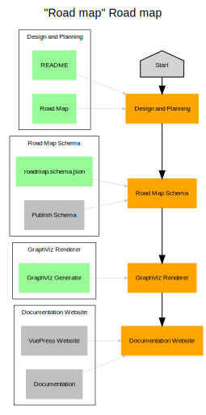

# Road map
**Generate your team's road-maps from structured data**

This project is designed to make visualizing and tweaking your road maps as easy
and straightforward as possible. There are a number of good options out there,
including PowerPoint, Visio, LucidChart, Draw.io, GraphViz and just plain old
lists - however none of them have made me particularly excited about drawing
up our team's road maps and many of them make future edits difficult.

The goal here is to change that, by defining your road map in everyone's least
loved markup language: YAML. An example road map might look something like the
following.

## Usage

### GraphViz
The easiest way to get started viewing your road map is to output a GraphViz DOT
file which can be rendered using any GraphViz renderer, like
[GraphViz Online](https://dreampuf.github.io/GraphvizOnline). To do so, you'll
need Go installed on your machine and then you can simply run:

```powershell
# Install the tool
go install github.com/SierraSoftworks/roadmap/tools/roadmap-graphviz@latest

# Run the tool
roadmap-graphviz --in my-roadmap.yml -out my-roadmap.dot
```

Drop the DOT file into your GraphViz renderer of choice and you're good to go!

## Example

```yaml
title: Example Road Map
description: |
    This is an example of what a road map might look like.

authors:
  - name: Benjamin Pannell
    email: contact@sierrasoftworks.com

timeline:
  - date: 2021-04-21
    title: Project Start
    description: This is when we will start working on the project, get the team ready!

milestones:
  - id: team
    title: Build the Team
    description: We don't yet have anyone, that's not gonna work...
    deliverables:
      - title: Team Lead
        state: TODO
        requirement: MUST
        description: This person needs to know enough about this domain to be able to run with the project.

      - title: Senior Engineer 1
      - title: Intern 1..50
        description: This should be cheaper than hiring a proper team (right?).

  - id: done
    title: Finish the Project
    description: We don't need other milestones, do we?
    dependencies:
      - team
    deliverables:
      - title: MVP
        description: Who needs a polished product? Let's just ship the MVP and call it done.
      - title: Marketing
      - title: VC Funding
      - title: Yacht
        reference: https://lmgtfy.app/?q=yacht&t=i
```


