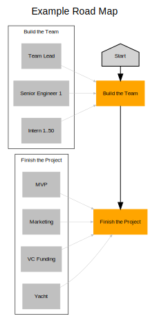

# Introduction
Road map was borne out of the need to quickly describe our team's road maps
in a visual and easy to understand fashion. Previously, we had used a combination
of PowerPoint, Visio, LucidCharts and GraphViz to present this information - with
each person doing their own thing. That doesn't scale particularly well and it
makes for a lot of work.

Being SREs, we don't like doing lots of work that doesn't scale - so we built
Road map to solve the problem once and for all. Road map is by no means as
powerful as any of the tools we used prior to it, but it doesn't have to be -
it is simple to use and describes the information we care about with minimal
fan-fare.

Enough talking, let's show you what we're talking about.

## Example
Here is an example road map and some examples of the visualizations which can
be generated based on it.

### Road Map
```yaml
title: Example Road Map
description: |
    This is an example of what a road map might look like. It can include **Markdown** if you
    wish.

authors:
  - name: Benjamin Pannell
    contact: contact@sierrasoftworks.com

timeline:
  - date: 2021-04-21
    title: Project Start
    description: This is when we will start working on the project, get the team ready!

milestones:
  - title: Build the Team
    description: We don't yet have anyone, that's not gonna work...
    deliverables:
      - title: Team Lead
        state: DONE
        requirement: MUST
        description: This person needs to know enough about this domain to be able to run with the project.

      - title: Senior Engineer No.1
        state: DOING
        requirement: SHOULD

      - title: Junior Engineer No.1
        state: TODO
        requirement: SHOULD

      - title: Barista
        state: SKIP
        requirement: MAY

  - title: Finish the Project
    description: We don't need other milestones, do we?
    deliverables:
      - title: MVP
        description: Who needs a polished product? Let's just ship the MVP and call it done.
      - title: Marketing
      - title: VC Funding
      - title: Yacht
        reference: https://lmgtfy.app/?q=yacht&t=i
```

### Outputs

#### GraphViz Chart

This chart was generated using our [GraphViz tool](/tools/visualizations/graphviz/README.md), which converts your `roadmap.yml` into a diagram
in DOT format. You can then render this diagram with GraphViz, or view it in an online tool like
[GraphViz Online](https://dreampuf.github.io/GraphvizOnline).

```powershell
go run github.com/SierraSoftworks/roadmap/tools/graphviz --in my-roadmap.yml
```

<p style="text-align: center; margin: 2rem auto;">


</p>