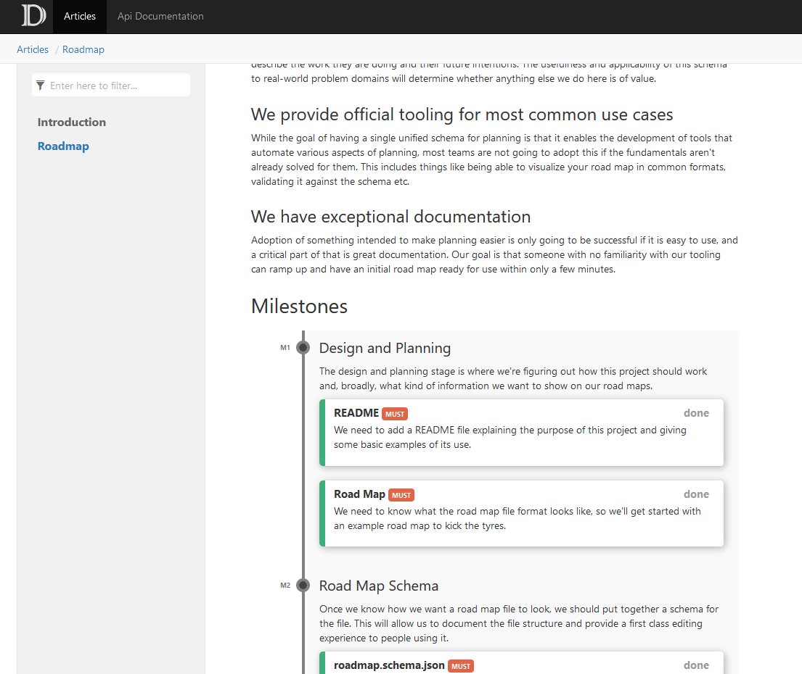

# DocFX
[DocFX](https://dotnet.github.io/docfx/index.html) is a powerful documentation generator and static website
builder. It is commonly used to host documentation for teams and projects, making it the perfect platform
to showcase your team's road map. Of course, needing to manually render your road map into Markdown and then
update the file isn't the best workflow, so we've built a DocFX plugin which will render your `roadmap.yml`
file into a gorgeous documentation page without any extra work on your part.

## Usage
### Prerequisites
You'll need DocFX installed on your machine and a prepared project, the best way to do this is by following
their [Getting Started Guide](https://dotnet.github.io/docfx/tutorial/docfx_getting_started.html).

### Installation
#### Using NuGet
The simplest way to install the package is using NuGet.

::: code-tabs
@tab PowerShell
```powershell
# NOTE: You might need to accept a warning prompt to let this access nuget.org
Install-Package -ExcludeVersion -Destination . -SkipDependencies -Name DocFX.Plugins.Roadmap -Force
```

@tab NuGet.exe
```powershell
# Make sure that you have the NuGet.exe on your path (https://www.nuget.org/downloads)
nuget install DocFX.Plugins.Roadmap -ExcludeVersion -OutputDirectory .
```
:::

#### Manual Installation
If you don't have NuGet installed, or would prefer to do things the hard way, then you can manually extract the package
by downloading it directly from NuGet.org. To do so, follow these steps.

1. Head to the [DocFX.Plugins.Roadmap](https://www.nuget.org/packages/DocFX.Plugins.Roadmap/) package on nuget.org.
2. Click the `Download Package` link on the right hand side, under the **About** heading.
3. Rename the file and add a `.zip` extension to it, it should now look something like `docfx.plugins.roadmap.1.0.10.nupkg.zip`.
4. Open your new zip file and extract the `content` directory into a `DocFX.Plugins.Roadmap/content` directory inside your project.

::: warning
If you are able to, NuGet is a much simpler way to install the package and is less prone to failure.
:::

#### Configuring DocFX
Once you have installed the plugin, you will need to configure DocFX to use it. This is done by adding the
plugin's `content` directory to your `template` list. This will cause DocFX to load the plugin and apply it
to any `roadmap.yml` files in your project.

```json{8}
// docfx.json
{
    "metadata": [],
    "build": {
        "content": [{ ... }],
        "resource": [{ ... }],
        "dest": "_site",
        "template": ["default", "DocFX.Plugins.Roadmap/content"]
    }
}
```

### Creating a Road map
Once you have installed the plugin, you can render a road map by placing a `roadmap.yml` file anywhere
within your configured DocFX content directories. The renderer will convert this into a `roadmap.html`
file and you can list in either your `toc.yml` files or link to it from other pages.


## Output
The renderer generates an HTML file which will leverage your existing DocFX theme and which looks
something like the following when rendered. The content generated by the renderer is plain HTML+CSS,
so it should be widely compatible and doesn't introduce any external dependencies.

### Rendered


