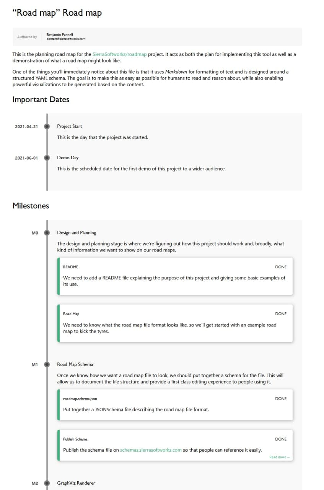

# HTML
If you're planning on making your road map visible to others, there are few better ways
to do so than through the internet. The simplest way to do that is to have a static
HTML file containing your road map and we've got just the tool to help generate it.

## Usage
### Prerequisites
Our HTML generator is written in [Go](https://golang.org), so you'll need to make
sure you've installed that on your machine. We recommend Go 1.16+ since it'll let you run
the tool without needing to clone the repo or do any manual building.

Once you have Go installed, run the following to get the project and make the tool
available to run.

```sh
# This installs the roadmap tool in your Go binaries folder.
go install github.com/SierraSoftworks/roadmap/tools/roadmap@latest
```

### Conversion
To convert your `roadmap.yml` file into its HTML representation, try running the following
command. It'll write the result to your terminal, but if you'd prefer, you can write it to a file as well.

:::: code-group
::: code-group-item stdout
```sh
roadmap render html --in roadmap.yml
```
:::

::: code-group-item file
```sh
roadmap render html --in roadmap.yml --out roadmap.html
```
:::
::::

### Serving 
To preview your roadmap document in your browser while you work on it, you can run the following command. Every time you save changes made to your roadmap file, the HTML representation will update to reflect those changes which can speed up your roadmap development!

```sh
roadmap serve html --in roadmap.yml
```

## Output
The output generated by this tool is an HTML file which can then be opened by your web browser.
It doesn't include any JavaScript and uses a static, inline, stylesheet - meaning it can be
easily viewed offline and shouldn't present any security risks (so long as you trust the
content of your road map document).

### Rendered


