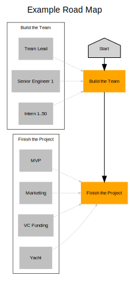

# GraphViz
GraphViz is an incredibly powerful tool for generating diagrams based on a textual
representation of the relationships between nodes. It is a great place to start if
you're trying to represent something like a road map, but writing it all by hand can
be a bit tedious.

Fortunately, we've built a tool to convert your `roadmap.yml` file into DOT, GraphViz's
textual graph description format.

## Usage
### Prerequisites
Our GraphViz conversion tool is written in [Go](https://golang.org), so you'll need to make
sure you've installed that on your machine. We recommend Go 1.16+ since it'll let you run
the conversion tool without needing to clone the repo or do any manual building.

Once you have Go installed, run the following to get the project and make the tool
available to run.

```sh
# This installs the roadmap tool in your Go binaries folder.
go install github.com/SierraSoftworks/roadmap/tools/roadmap@latest
```

### Conversion
To convert your `roadmap.yml` file into its DOT representation, try running the following
command. It'll write the result to your terminal, but if you'd prefer, you can write it to a file as well.

:::: code-group
::: code-group-item stdout
```sh
roadmap render graphviz --in roadmap.yml
```
:::

::: code-group-item file
```sh
roadmap render graphviz --in roadmap.yml --out roadmap.dot
```
:::
::::

## Output
The output generated by this tool is a DOT file which can then be rendered using GraphViz.
One of the quickest ways to get started is to use an online GraphViz renderer like
[GraphViz Online](https://dreampuf.github.io/GraphvizOnline) to view the result.

### Rendered



### DOT File


